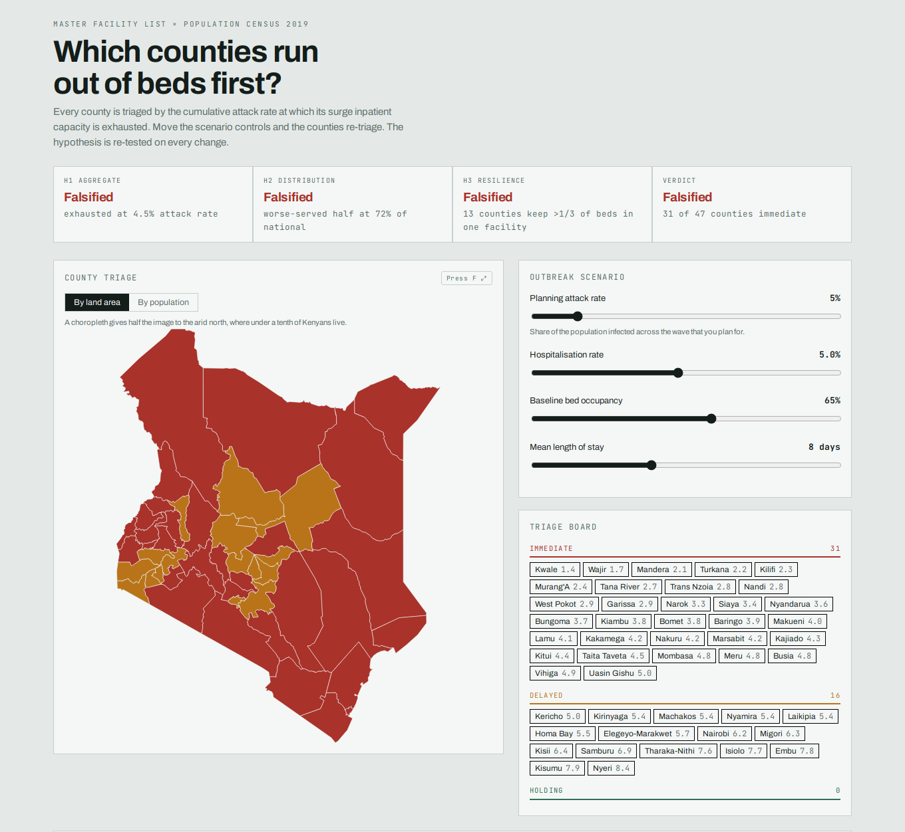

# How prepared is Kenya for a disease outbreak?

[](https://github.com/ChristopherKiokoStrathmore/SLIDES/actions/workflows/ci.yml)
[](LICENSE)



Live map: [https://slides-pink-ten.vercel.app](https://slides-pink-ten.vercel.app)

An interactive map that triages Kenya's 47 counties by the cumulative attack rate
at which their surge inpatient capacity is exhausted. Move the scenario controls
and the counties re-triage; the hypothesis is re-tested on every change.

Built from the Kenya Master Health Facility List (August 2017, n=8,932) and the
2019 Kenya Population and Housing Census.

## The presentation deck

`presentation/covid-capacity-deck.html` is a three-slide data story built round
COVID-19 as the case study, structured on **STAR** (Situation & Task, Action,
Result). It is a **single self-contained file**: GSAP, Three.js, Motion One, Animate.css and the
county table are all inlined, so it opens from a USB stick with no server and no
network. Double-click it, press **F**, and present.

```
→ / space   next        ← back        1 / 2 / 3   jump to slide       F  fullscreen
```

The deck is deliberately **not** the model. It states one scenario and tells the
story; `index.html` is where the parameters can be argued with. Each slide carries
one interaction: the facility block on slide 1 (Three.js), the wave sweep on slide 2
(GSAP, replay and scrub), and a replayable build of three charts on slide 3.
The deck carries no map, so it needs no boundary geometry and no D3.
`presentation/TALKING-POINTS.md` scripts six presenters, two per slide, with handoff
cues, a Q&A table and a timing card.

Animation is layered so that **no figure ever depends on an animation completing**:
`requestAnimationFrame` does not fire at all in a hidden tab, so every reveal,
counter and the wave carry a wall-clock fallback that writes the final state
directly. Open the deck in a background tab and it still reads correctly.

Rebuild after editing the template or the analysis:

```bash
python3 presentation/build_deck.py
```

## Run the interactive app

```bash
python3 -m http.server 8000     # then open http://localhost:8000
```

Or just double-click `index.html`, because the data, the map geometry and D3 are all
bundled, so it works offline from `file://`. The only network request is for
webfonts, and it falls back to system sans if those don't load.

## Deploy

The live map is [https://slides-pink-ten.vercel.app](https://slides-pink-ten.vercel.app),
served from Vercel with no build command and publish directory `.`.

**Netlify / Cloudflare Pages**, the same: no build command, publish directory `.`.

**Any static host**, upload `index.html` and `vendor/`. Nothing else is needed
at runtime; `data/`, `src/` and `test/` are build-time only.

`.github/workflows/ci.yml` runs `node test/verify.js` on every push.

## Rebuild after changing the analysis

`index.html` embeds a *snapshot* of the data. Change the numbers upstream and the
page will quietly keep showing the old ones until you rebuild.

```bash
python3 src/prep_data.py        # county_capacity.csv + geojson -> data/web_data.json
python3 src/build.py            # data + template            -> index.html
node test/verify.js             # confirm the app still matches the committed county table
```

`src/prep_data.py` expects `county_capacity.csv` and `kenya_counties.geojson` in
the working directory, so run it from `data/`, or edit the paths at the top.

The analysis notebook is not included in this repository. `data/county_capacity.csv`
is the committed county table the app was built from, and `test/verify.js` checks
the app against that table.

## The model

For each county, the attack rate at which peak inpatient demand exactly exhausts
surge-available beds:

```
                beds x (1 - occupancy) x 1.20 x 84
attack rate* = -------------------------------------
                pop x hospRate x lengthOfStay x 2.5
```

The step from peak admissions per day to concurrent beds is Little's Law
(L = λW): beds occupied equals arrival rate times length of stay.

Fixed constants: 84-day wave, peak daily incidence at 2.5x the wave average,
20% surge uplift from cancelling electives and converting wards.

**Only two of the seven inputs are measured.** Beds and population come from the
source data. Occupancy, surge uplift and the peak factor are assumptions;
hospitalisation rate and length of stay are pathogen properties the user sets.

## What the tool cannot tell you

The facility list carries no ICU, oxygen, isolation or laboratory information,
because the `Service_names` column is empty in all 8,932 rows, and no staffing data.
Kenya's binding constraints during COVID were oxygen and critical-care staffing
rather than general beds, so **every figure here is an optimistic bound**.

Two further caveats worth stating alongside any result:

- Hospitalisation rates in the literature come largely from populations with a
  median age near 40. Kenya's is around 20, so an imported rate likely overstates
  admissions. This pushes the opposite way from the beds-only limitation; the
  magnitudes are unknown and they should not be assumed to cancel.
- Counties are modelled as closed systems, but 32 of 47 have no Level 5/6
  referral facility, so severe cases cross boundaries in reality.

This is a static peak calculation, not an epidemic model. There is no
transmission dynamic and no depletion of susceptibles, so the wave shape is
imposed by two constants rather than emerging from an SEIR process.

## Layout

```
docs/hero-county-triage.png screenshot of the live map
index.html                  built artifact - do not edit by hand
presentation/
  covid-capacity-deck.html  built artifact - the 3-slide deck, fully self-contained
  deck.template.html        the deck source, with __GSAP__/__THREE__/__DATA__ placeholders
  build_deck.py             inlines the vendor libs + data into one file
  TALKING-POINTS.md         script for six presenters, two per slide
  TALKING-POINTS.pdf        the same, typeset for paper
  build_talking_points_pdf.py  renders that script to PDF
vendor/d3.min.js            D3 v7.8.5, bundled for offline use
vendor/gsap.min.js          GSAP v3.12.5, the deck's animation engine
vendor/three.min.js         Three.js r150, the slide 1 facility cloud
vendor/motion.min.js        Motion One v10.18, spring transitions
vendor/animate.min.css      Animate.css v4.1.1, entrance utilities
data/web_data.json          embedded payload: geometry + county metrics
data/county_capacity.csv    committed county table (the analysis notebook is not in this repo)
data/kenya_counties.geojson source boundaries
src/app.template.html       the app, with a __DATA__ placeholder
src/prep_data.py            builds web_data.json
src/build.py                builds index.html
test/verify.js              regression test against the committed county table
```

## Team and my role

Git history records two contributors:

- Dennis Wambua committed the initial interactive map, the county data, and fullscreen mode.
- Christopher Nguu Kioko committed the three-slide presentation deck and the opening-slide title.

`presentation/TALKING-POINTS.md` scripts six presenters and leaves their names as placeholders.

Christopher Nguu Kioko - co-author

## Sources

County boundaries are a community GitHub dataset, adequate for analysis but not
authoritative. For publication, substitute official boundaries, either OCHA's Kenya
admin boundaries on HDX, or the IEBC/KNBS county shapefiles, then re-run
`test/verify.js` to confirm nothing shifted.
